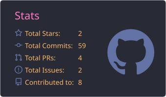
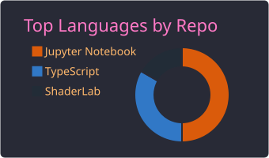

Hi, I'm Josh. I'm an AI + Design Engineer making systems that matters. [View resume](https://drive.google.com/file/d/16ebuqXvVbdBxEKRYjMVmd4Q9Utnz1rbV/view?usp=sharing).

Experience: [`Eskwelabs`](https://eskwelabs.com) (Data Modeling Internship) [`Data Engineering Pilipinas`](https://tpp.dataengineering.ph/) (Project GabayPoz volunteer) 

|  |  |
| --- | --- |

 
Above stats generated with: [`tipsy/profile-summary-for-github`](https://github.com/tipsy/profile-summary-for-github)

# Recent Projects

1. [Consumer Review RAG](https://consumer-review-rag.streamlit.app/) (Python, ChromaDB, Streamlit) ([code](https://github.com/boosquack/consumer-review-rag))
   - Exploratory analysis and a cited question-answering app over public Amazon reviews of three P&G haircare brands. Every answer cites its source reviews, and the app declines when the reviews do not cover the question. Scored on an 18-question gold set (retrieval hit@6 of 0.86), with the failures documented. The first load can take a few minutes.
2. [Naya](https://nayaph.tech) (Flutter, Django, PostgreSQL)
   - A maternal care app for Filipino mothers covering prenatal care, childbirth prep, and postpartum, with a dashboard for doctors to track patients between visits. Currently in a feasibility beta for my thesis.
3. [Project GabayPoz](https://gabaypoz.org/) 
   - A community system for Pozzorubio, Pangasinan that matches students to academic programs and funding. I helped build the scholarship registry behind it as a volunteer with Data Engineering Pilipinas.
